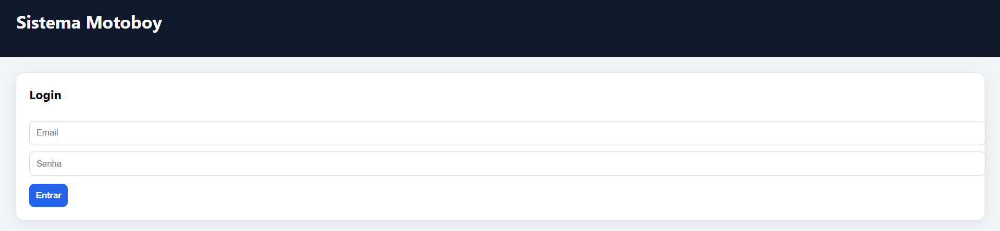
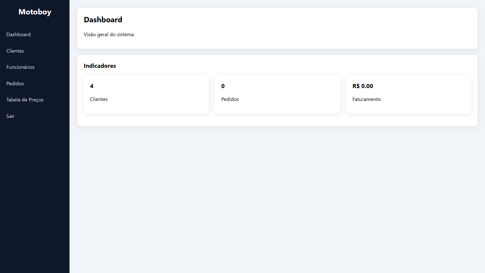
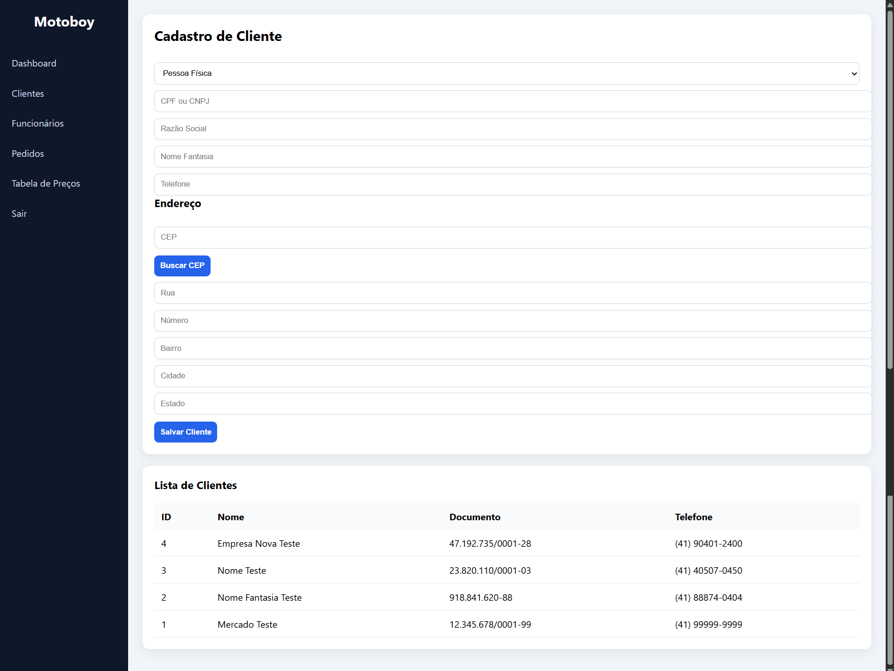
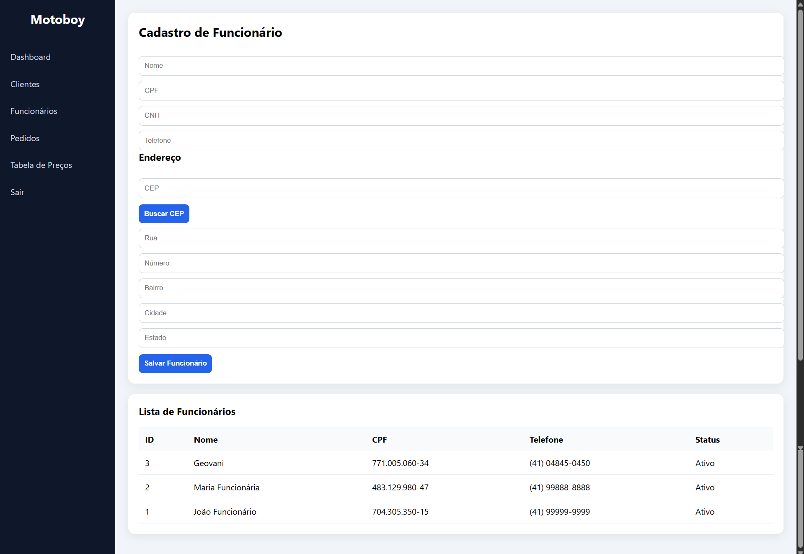
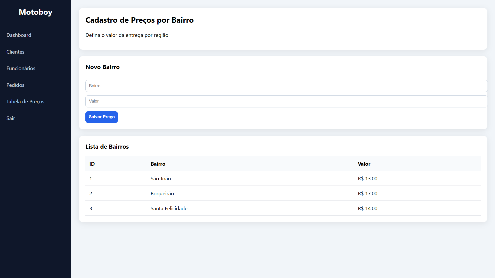

# Sistema de Gestão de Entregas - Motoboy

Projeto desenvolvido como Trabalho de Conclusão de Curso (TCC) da pós-graduação em Desenvolvimento Full Stack pela PUCRS.
O sistema tem como objetivo realizar o controle de pedidos de entrega de uma empresa de motoboys, permitindo o cadastro de clientes, funcionários, valores por bairro e gerenciamento completo das entregas.

---

# Funcionalidades

### Autenticação
- Login com JWT
- Rotas protegidas
- Controle de usuário administrador

### Clientes
- Cadastro PF e PJ
- CPF/CNPJ com validação e máscara
- Endereço completo com busca automática por CEP
- Listagem de clientes

### Funcionários (Motoboys)
- Cadastro completo
- CPF, CNH e telefone
- Endereço completo com busca automática por CEP
- Status ativo/inativo
- Listagem de funcionários

### Tabela de Preço por Bairro
- Cadastro de valor por bairro
- Utilizado automaticamente no pedido

### Pedidos(Em desenvolvimeno)
- Seleção de cliente
- Seleção de motoboy
- Endereço de entrega completo com busca automática por CEP
- Cálculo automático do valor por bairro
- Status do pedido

---

# Arquitetura

O projeto foi desenvolvido seguindo boas práticas de desenvolvimento Full Stack e conceitos de arquitetura em camadas.

### Backend
- Node.js
- Express
- Prisma ORM
- PostgreSQL
- JWT autenticação
- Arquitetura em camadas (Controller, Service, Routes)

### Frontend
- HTML
- CSS
- JavaScript puro
- Consumo de API REST

### Banco de Dados
- PostgreSQL
- Modelagem relacional
- Normalização de dados
- Controle de integridade

### DevOps
- Docker e Docker Compose
- GitHub
- CI/CD com GitHub Actions
- Testes automatizados com Jest

---

# Telas do Sistema

## Login

## Dashboard

## Cadastro de Clientes

## Cadastro de Funcionários

## Tabela de Preços

## Pedido (Em desenvolvimento)

---

# Como executar o projeto

## Pré-requisitos
- Docker
- Docker Compose
- Node.js (opcional para rodar local)

---

## Subir projeto completo
- docker compose up -d

## Backend disponível em:
- http://localhost:8080

## Frontend
- abrir index.html no navegador

---

# Executar testes automatizados(Em desenvolvimento)
- npm install
- npm test

## Os testes validam:
- login
- autenticação
- criação de cliente
- rotas protegidas

# Pipeline CI/CD
## O projeto possui pipeline automatizada no GitHub Actions que executa:
- Instalação de dependências
- Subida de banco PostgreSQL
- Migrations Prisma
- Testes automatizados

Executada a cada push no repositório.

---

# Objetivo acadêmico

Este projeto foi desenvolvido com fins acadêmicos para aplicação prática dos conhecimentos adquiridos na pós-graduação.
O sistema foi inspirado em uma empresa real de entregas, com o objetivo de simular um ambiente profissional de desenvolvimento de software.